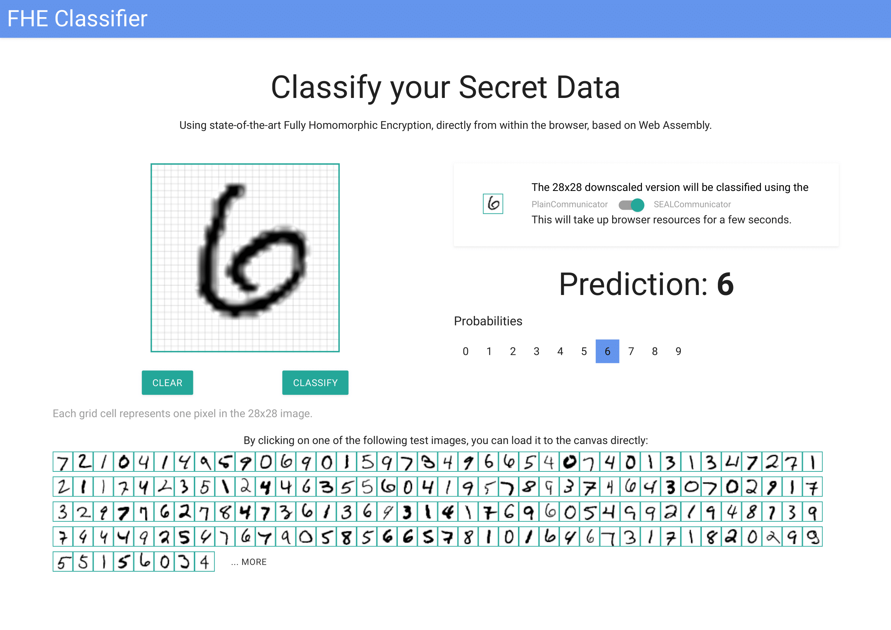

# Secure Classification as a Service

My bachelor's [thesis](https://raw.githubusercontent.com/MrP01/BachelorsThesis/master/thesis/thesis.pdf) for Physics and ICE (Information and Computer Engineering), submitted in August 2022 to the Technical University of Graz. **Goal**: Classifying MNIST images on the server using homomorphic encryption.

Advisor: Roman Walch of the IAIK.

The rapid developments in quantum computation affect cryptography as it is used today. With
a sufficiently powerful quantum computer, most digital communication could be decrypted in
polynomial time by an eavesdropping party with access to such a potent utility, posing a major
problem to the worldwide community. Lattice-based cryptographic schemes aim to mitigate
this, while including many further advantages, which will be the main topic of this thesis.
With technological advancements in machine learning, problems long thought to be impossible
can now be solved by complicated and resource-intensive neural network structures. Machine
learning undoubtedly holds many new possibilities, especially in medicine, although large
datasets are especially scarce in this area. Privacy-Preserving Machine Learning (PPML) is
an emerging field in data science that focusses on leveraging such highly private data anyway,
without ever actually seeing it. The techniques behind this are homomorphic encryption schemes,
two of which this thesis will discuss in detail.

To demonstrate the possibilities of these homomorphic cryptosystems applied to machine
learning inference, a web-based demonstrator for the classification of handwritten digits was
developed. The backend server is written in C++, using the Microsoft SEAL
homomorphic encryption library. This work starts by introducing the necessary mathematical
background, motivating the definitions of the BFV and CKKS encryption schemes in the
following chapter and describing the basics of machine learning along the way. The quantum-
mechanical principles and implications of Shor’s algorithm are discussed, further inciting the
need for studying the hardness of the LWE-based cryptosystems. The final chapters then focus
on implementation aspects, the analysis of obtained results and performance benchmarks.

To quickly run the demonstrator on your machine using Docker:

    docker run --name classifier --detach mrp001/sealed-mnist-classifier
    docker run -p 80:80 -p 443:443 --link classifier mrp001/sealed-mnist-frontend

For more information on the setup and installation details of the project, please see the [code README](code/README.md).

Here is a screenshot of the (minimalistic) GUI:

## Status

- [✓] Translating Classifier from MatLab to C++
- [✓] Frontend using small React App, node-seal for HE
- [✓] Backend in C++
- [✓] Zuerst ein einfaches Neural Network ohne homomorphic encryption trainieren (entweder in python oder C++).
  Wie wir bereits am Donnerstag besprochen haben, müssen die Aktivierungsfunktionen (Relu, Sigmoid, etc.)
  für HE approximiert werden. Experimentiere dafür auch schon in der Plain Implementierung, welche Auswirkungen
  das auf die Accuracy des Netzwerks hat.
- [✓] Exportieren des Neural Networks (Anzahl Neuronen und Layer, die trainierten Weights, ...)
  damit dieses für das HE Netzwerk verwendet werden kann.
- [✓] Implementierung des Netzwerkes in SEAL (C++)
- [✓] Für den Web-basierten Demonstrator kannst du dann deine Implementierung nach Node-SEAL,
  einen javascript wrapper für die SEAL library, portieren. Der Demonstrator soll folgende Funktionen haben:
  Ein Client sendet ein verschlüsseltes Bild zum Server, der Server benutzt deine Implementierung
  um eine verschlüsselte Klassifizierung zu erzeugen, welche dann vom Client entschlüsselt werden kann.
  Am besten eine einfache Website zur Nutzung für den Client entwickeln.
- [✓] Für ein einfaches Deployment soll am Ende alles in einem Docker Container laufen.
- [✓] Wenn noch Zeit ist, können wir das Thema auch noch auf den smart-meetering use case von dir ausweiten, für uns steht in erster Linie jedoch der Demonstrator im Vordergrund.
- [✓] Am Ende musst du dann noch deine Arbeit in Form von einer schriftlichen Thesis niederschreiben und deine Ergebnisse präsentieren.
- Create Conan package of SEAL?
- [✓] Taylor approximate ReLU(x) = 0.54738 + 0.59579 x + 0.090189 x^2 - 0.006137 x^3.

## Documentation

- Your thesis
- Your source code contributions
- Your presentations and posters
